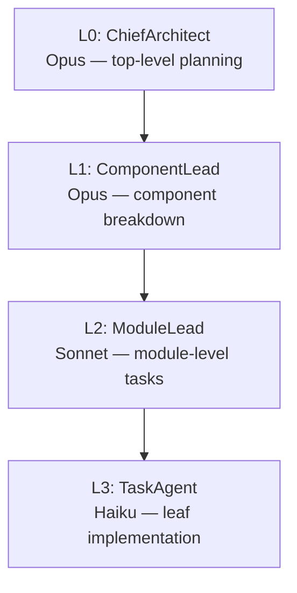

# AGENTS.md — ProjectAgamemnon Multi-Agent Handoff Protocols

This document describes how AI agents interact with ProjectAgamemnon: its role in the
HomericIntelligence mesh, the hierarchy it orchestrates, the NATS-based handoff protocols
for each peer component, and the REST API surface agents use.

All claims here are derived from source code, not aspirational documentation.

---

## Role in the HomericIntelligence Mesh

Agamemnon is the **coordination layer** between research and execution:

```
User <-> Odysseus <-> Nestor <-> Agamemnon <-> agentic pipeline loop -> completion
```

Agamemnon receives researched briefs from **ProjectNestor**, breaks them into tasks,
orchestrates the HMAS hierarchy, and enqueues work for **Myrmidons** to pull.

**What Agamemnon does NOT do:**

- Research (that is Nestor's responsibility)
- Provide UI (that is Odysseus's responsibility)
- Route messages between Myrmidons (Myrmidons communicate peer-to-peer directly)
- Make myrmidon-level implementation decisions
- Perform peer discovery (not implemented in code)

---

## Agent Hierarchy (HMAS)

Agamemnon orchestrates a 4-layer Hierarchical Multi-Agent System:



| Layer | Role | Model Tier |
| ----- | ---- | ---------- |
| L0 | ChiefArchitect — top-level planning and approval gate | Opus |
| L1 | ComponentLead — per-component breakdown | Opus |
| L2 | ModuleLead — module-level task delegation | Sonnet |
| L3 | TaskAgent — leaf implementation worker | Haiku |

Delegation flows top-down. Agents can clarify upstream at every stage (bidirectional).

---

## Upstream Handoff: ProjectNestor → Agamemnon

Nestor submits a researched brief as a task creation request.

**Protocol:** `POST /v1/teams/:team_id/tasks`

**Request body (JSON):**

| Field | Type | Default | Description |
| ----- | ---- | ------- | ----------- |
| `subject` | string | `""` | Short task title |
| `description` | string | `""` | Full task brief from Nestor |
| `assigneeAgentId` | string | `""` | Pre-assigned agent ID (optional) |
| `blockedBy` | array | `[]` | Task IDs this task depends on |
| `type` | string | `"general"` | Myrmidon type to dispatch to |

**Auto-set by Agamemnon (do not include in request):**

| Field | Value |
| ----- | ----- |
| `id` | Generated UUID |
| `teamId` | From URL path |
| `status` | `"pending"` |
| `createdAt` | ISO 8601 timestamp |
| `completedAt` | `null` |

**On receipt, Agamemnon:**

1. Persists the task in the in-memory store
2. Publishes `hi.tasks.created` to notify observers
3. Enqueues the task to `hi.myrmidon.{type}.{task_id}` for myrmidon pickup
4. Logs dispatch to `hi.logs.agamemnon.task_dispatched`

---

## Downstream Handoff: Agamemnon → Myrmidons

Agamemnon uses a **pull-based** queue. Myrmidons pull work when ready; Agamemnon never
pushes directly to a myrmidon.

**Queue subject:** `hi.myrmidon.{type}.{task_id}`

**Stream:** `homeric-myrmidon` (subject filter: `hi.myrmidon.>`)

**Critical invariant — `MaxAckPending=1`:** Each myrmidon processes exactly one task at a
time. A myrmidon must acknowledge (or nack) the current task before receiving another. This
prevents work pile-up on a single worker.

**Myrmidon completion flow:**

1. Myrmidon completes work and publishes to `hi.tasks.{team_id}.{task_id}.completed`
2. Agamemnon receives via its subscription on `hi.tasks.*.*.completed`
   (source: `src/server_main.cpp:36`)
3. Agamemnon updates task status and publishes `hi.tasks.{team_id}.{task_id}.updated`
4. Agamemnon logs to `hi.logs.agamemnon.task_completed`

---

## Observer Handoff: Agamemnon → Odysseus

Odysseus observes pipeline state independently — Agamemnon does not call Odysseus directly.

**Subjects Odysseus subscribes to:**

| Subject | When published |
| ------- | -------------- |
| `hi.tasks.created` | New task accepted |
| `hi.tasks.{team_id}.{task_id}.updated` | Task status changed |
| `hi.pipeline.>` | Pipeline state updates |

**Streams:** `homeric-tasks` and `homeric-pipeline`

---

## NATS Subjects Reference

| Subject | Direction | Publisher | Subscriber |
| ------- | --------- | --------- | ---------- |
| `hi.tasks.created` | pub | Agamemnon | Odysseus |
| `hi.tasks.*.*.completed` | sub | Myrmidons | Agamemnon |
| `hi.tasks.{team_id}.{task_id}.updated` | pub | Agamemnon | Odysseus |
| `hi.myrmidon.{type}.{task_id}` | pub | Agamemnon | Myrmidons (pull) |
| `hi.agents.{host}.{name}.created` | pub | Agamemnon | Observers |
| `hi.agents.{host}.{name}.updated` | pub | Agamemnon | Observers |
| `hi.agents.{host}.{name}.deleted` | pub | Agamemnon | Observers |
| `hi.agents.team.created` | pub | Agamemnon | Observers |
| `hi.agents.team.updated` | pub | Agamemnon | Observers |
| `hi.agents.team.deleted` | pub | Agamemnon | Observers |
| `hi.agents.chaos.injected` | pub | Agamemnon | ProjectCharybdis |
| `hi.agents.chaos.removed` | pub | Agamemnon | ProjectCharybdis |
| `hi.logs.agamemnon.agent_created` | pub | Agamemnon | Log consumers |
| `hi.logs.agamemnon.task_dispatched` | pub | Agamemnon | Log consumers |
| `hi.logs.agamemnon.task_completed` | pub | Agamemnon | Log consumers |
| `hi.pipeline.>` | pub | Agamemnon | Odysseus |
| `hi.research.>` | — | Nestor | (future use) |

---

## JetStream Streams Reference

All streams use file storage (`js_FileStorage`) and limits retention (`js_LimitsPolicy`).
Source: `src/nats_client.cpp`, `ensure_streams()`.

| Stream | Subject Filter | Primary Users |
| ------ | -------------- | ------------- |
| `homeric-agents` | `hi.agents.>` | Agent lifecycle events |
| `homeric-tasks` | `hi.tasks.>` | Task state — Agamemnon, Odysseus |
| `homeric-myrmidon` | `hi.myrmidon.>` | Work queue — Agamemnon enqueues, Myrmidons pull |
| `homeric-research` | `hi.research.>` | Research briefs from Nestor |
| `homeric-pipeline` | `hi.pipeline.>` | Pipeline state — Odysseus reads |
| `homeric-logs` | `hi.logs.>` | Structured audit logs |

---

## REST API for Agents

**Base URL:** `http://{host}:8080` (default; override with `PORT` env var)

### Health

| Method | Path | Description |
| ------ | ---- | ----------- |
| GET | `/health` | Liveness check |
| GET | `/v1/health` | Versioned liveness check |
| GET | `/v1/version` | Service version |

### Agents

| Method | Path | Description |
| ------ | ---- | ----------- |
| GET | `/v1/agents` | List all agents |
| POST | `/v1/agents` | Register a new agent |
| POST | `/v1/agents/docker` | Register a Docker-based agent |
| GET | `/v1/agents/:id` | Get agent by ID |
| GET | `/v1/agents/by-name/:name` | Get agent by name |
| PATCH | `/v1/agents/:id` | Update agent |
| POST | `/v1/agents/:id/start` | Start agent |
| POST | `/v1/agents/:id/stop` | Stop agent |
| DELETE | `/v1/agents/:id` | Delete agent |

### Teams

| Method | Path | Description |
| ------ | ---- | ----------- |
| GET | `/v1/teams` | List all teams |
| POST | `/v1/teams` | Create a team |
| GET | `/v1/teams/:id` | Get team by ID |
| PUT | `/v1/teams/:id` | Replace team |
| DELETE | `/v1/teams/:id` | Delete team |

### Tasks

| Method | Path | Description |
| ------ | ---- | ----------- |
| GET | `/v1/tasks` | List all tasks |
| GET | `/v1/teams/:team_id/tasks` | List tasks for a team |
| POST | `/v1/teams/:team_id/tasks` | Create task (Nestor entry point) |
| GET | `/v1/teams/:team_id/tasks/:task_id` | Get task |
| PUT | `/v1/teams/:team_id/tasks/:task_id` | Replace task |
| PATCH | `/v1/teams/:team_id/tasks/:task_id` | Update task fields |

### Workflows

| Method | Path | Description |
| ------ | ---- | ----------- |
| GET | `/v1/workflows` | List workflows |

### Chaos

| Method | Path | Description |
| ------ | ---- | ----------- |
| GET | `/v1/chaos` | List active chaos scenarios |
| POST | `/v1/chaos/:type` | Inject a chaos scenario |
| DELETE | `/v1/chaos/:id` | Remove a chaos scenario |

---

## Chaos Injection Protocol (ProjectCharybdis)

ProjectCharybdis drives fault injection via Agamemnon's `/v1/chaos/*` routes.

**Inject:** `POST /v1/chaos/:type`

- Agamemnon registers the scenario and publishes `hi.agents.chaos.injected`

**Remove:** `DELETE /v1/chaos/:id`

- Agamemnon removes the scenario and publishes `hi.agents.chaos.removed`

Charybdis subscribes to both subjects to track active fault state independently.

---

## Environment Configuration

| Variable | Default | Description |
| -------- | ------- | ----------- |
| `PORT` | `8080` | HTTP listening port |
| `NATS_URL` | `nats://localhost:4222` | NATS server URL (over Tailscale in production) |

---

## Transport Layer Note

All NATS communication flows through **ProjectKeystone**, which provides transparent routing:

- Local (intra-host): BlazingMQ + C++20 MessageBus *(planned, not yet implemented in this repo)*
- Cross-host: NATS JetStream via nats.c over Tailscale

The code in this repository uses NATS directly. Keystone integration is handled at the
infrastructure layer outside this service.
