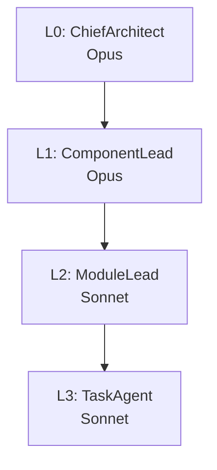

# AGENTS.md — Agamemnon Multi-Agent Coordination

This file is the sole authoritative agent contract for this repository.

## Overview

Agamemnon is the HMAS (Homeric Multi-Agent System) orchestration service within the
HomericIntelligence distributed agent mesh. It is the planning, coordination, and agentic
orchestration service for the mesh, replacing ai-maestro's task coordination role (per ADR-006 in
Odysseus). It receives researched briefs from ProjectNestor and manages the full 4-layer agent
hierarchy: planning breakdown, delegation, state machine coordination, and pull-based work queue
management.

**Pipeline position:** User → Odysseus → Nestor → **Agamemnon** → agentic pipeline loop → completion

Agamemnon receives researched briefs from ProjectNestor and manages:

- Planning breakdown (inter-repo → per-repo → module → sub-module → impl details)
- HMAS 4-layer agentic hierarchy (L0 ChiefArchitect → L1 ComponentLead → L2 ModuleLead → L3 TaskAgent)
- State machine coordination for each task
- Pull-based work queue: enqueues tasks for myrmidons to pull
- GitHub Issues/Projects as backing store (not SQLite)
- REST API: `/v1/*` (coordination) and `/v1/chaos/*` (chaos injection for ProjectCharybdis)
- Peer discovery via Tailscale (100.x.x.x scan)

Agamemnon does **not** perform research (Nestor's responsibility), provide UI (Odysseus), or make
myrmidon-level decisions (myrmidons communicate peer-to-peer directly).

### Key Principles

1. **Pull-based:** Agamemnon enqueues work. Myrmidons pull when ready. MaxAckPending=1.
2. **GitHub = backing store:** All task state lives in GitHub Issues/Projects.
3. **Bidirectional:** Agents can clarify upstream at every stage.
4. **No research:** Receives researched briefs only. All research is Nestor's responsibility.
5. **HMAS hierarchy:** L0→L3 internal orchestration primitives manage delegation and escalation.

---

## Agent Hierarchy

The model tiers below are fixed. Divergence between this hierarchy and any other documentation of
it is treated as a documentation bug.

### ASCII Tree

```
L0  ChiefArchitect   (Opus)
 └── L1  ComponentLead   (Opus)
      └── L2  ModuleLead     (Sonnet)
           └── L3  TaskAgent     (Sonnet)
```

### Mermaid Diagram



### Model Tier Assignments

| Layer | Role | Approved Model |
| --- | --- | --- |
| L0 | ChiefArchitect | Opus |
| L1 | ComponentLead | Opus |
| L2 | ModuleLead | Sonnet |
| L3 | TaskAgent | Sonnet |

---

## Role Definitions

### L0 — ChiefArchitect (Opus)

- Receives the researched brief from Nestor
- Owns the top-level plan: inter-repo decomposition, cross-cutting concerns, sequencing
- Delegates inter-repo tasks to one or more L1 ComponentLeads
- Gates: approves all destructive or state-modifying operations before they proceed
- Escalates: if clarification is needed, L0 communicates upstream to Nestor/Odysseus

### L1 — ComponentLead (Opus)

- Owns a single repository or major component within the plan
- Breaks the component scope into modules and delegates to L2 ModuleLeads
- Monitors L2 progress; escalates blockers to L0
- Produces per-component summaries consumed by L0 for plan reconciliation

### L2 — ModuleLead (Sonnet)

- Owns a single module or sub-component within a repository
- Breaks the module scope into concrete implementation tasks and delegates to L3 TaskAgents
- Reviews L3 output for correctness before acknowledging completion to L1
- Gates: approves file deletions or schema-altering operations before dispatching to L3

### L3 — TaskAgent (Sonnet)

- Executes a single, bounded implementation task (file edit, test run, build check)
- Pulls work from the NATS PULL consumer for its myrmidon type (`hi.myrmidon.{type}.>`)
- Reports completion or failure to L2; does **not** self-assign follow-on tasks
- MaxAckPending=1: processes exactly one task at a time before acknowledging

---

## Delegation Rules

1. **Top-down delegation only.** Work flows L0 → L1 → L2 → L3. Levels do not skip.
2. **Bottom-up escalation only.** Blockers, ambiguity, and failures propagate upward one level at
   a time.
3. **Approval gates before destructive operations.** Any operation that deletes files, modifies
   shared state, or alters a GitHub Issue/Project must be approved by the delegating level before
   the receiving level executes it.
4. **Clarification is always allowed.** Any level may pause and send a clarification request
   upstream rather than proceeding with an ambiguous or risky action.
5. **No lateral communication between same-level agents.** L3 TaskAgents do not coordinate
   directly; all coordination passes through L2.

---

## Handoff Protocols — NATS Subjects

All inter-component messaging flows through ProjectKeystone as the invisible transport layer.
Components publish and subscribe to logical NATS subjects; routing is transparent:

- Local (intra-host): BlazingMQ + C++20 MessageBus
- Cross-host: NATS JetStream via nats.c v3.9.1 over Tailscale

| Subject | Direction | Purpose |
| ------- | --------- | ------- |
| `hi.tasks.>` | pub/sub | Task state updates; Odysseus reads for UI |
| `hi.pipeline.>` | pub/sub | Pipeline state updates; Odysseus reads for UI |
| `hi.myrmidon.{type}.>` | PULL consumer | Work queue per myrmidon type; L3 agents pull |

**PULL consumer contract:**

- Myrmidons pull work when they are ready. Agamemnon never pushes.
- `MaxAckPending=1` enforces single-task-at-a-time per myrmidon.
- A task is not re-queued until the myrmidon acknowledges (success) or nacks (failure/timeout).
- `{type}` corresponds to the myrmidon specialisation (e.g. `codegen`, `test`, `review`).

> **`MaxAckPending=1` is a consumer-side contract.** Agamemnon does not configure
> this value in its own source — it is set when each myrmidon creates its PULL
> consumer (see `Myrmidons` repo). Agamemnon assumes the contract holds and
> publishes one work item at a time per myrmidon `{type}`. Verifying the bound
> requires inspecting the consumer config in the myrmidon process, not Agamemnon.

---

## Liveness & Readiness Probes

Agamemnon exposes two HTTP health endpoints. Both are unauthenticated and safe
to scrape from sidecars or k8s/Nomad probes.

| Endpoint | Use | Status code | Body |
| --- | --- | --- | --- |
| `GET /health` | Liveness — process is up | `200` | `{"status":"ok","service":"Agamemnon"}` |
| `GET /v1/health` | Readiness — versioned API surface is live | `200` | `{"status":"ok"}` |

Probes should treat any non-`200` response (including connection refused) as
failure. There is no `/v1/ready` endpoint distinct from `/v1/health`; readiness
gating that requires NATS connectivity must be implemented externally (e.g. a
sidecar that probes both `/v1/health` and the NATS port).

---

## Task Update Semantics: PUT vs PATCH

The route `/v1/teams/:team_id/tasks/:task_id` is registered for both `PUT` and
`PATCH` (see `src/routes.cpp` around line 657). They share an `update_task_handler`
and the verbs differ semantically rather than structurally:

| Verb | Intended use | Body shape | Behaviour |
| --- | --- | --- | --- |
| `PUT` | Telemachy-style full replace | Full task object | Replaces all mutable fields with the request body |
| `PATCH` | Partial update | Subset of mutable fields | Replaces only the provided keys; other fields untouched |

Both verbs return `200` with the updated task on success and `404` if the
`task_id` is unknown to the given `team_id`. Telemachy callers should use `PUT`;
incremental client updates should use `PATCH`.

---

## State Persistence

GitHub Issues and GitHub Projects are the sole backing store for task and pipeline state.

- Each task maps to a GitHub Issue.
- Each pipeline corresponds to a GitHub Project.
- No relational database, no in-memory store, no SQLite.
- State transitions are durable and auditable via GitHub's event timeline.

---

## Pull-Based Work Queue Contract

Agamemnon enqueues work; myrmidons pull when ready. The contract is:

1. Agamemnon creates (or updates) a GitHub Issue representing the task.
2. Agamemnon publishes the task descriptor to the relevant `hi.myrmidon.{type}.>` subject.
3. An available L3 myrmidon pulls the message from its PULL consumer.
4. The myrmidon executes the task, then acknowledges or nacks the NATS message.
5. Agamemnon updates the GitHub Issue state based on the ack/nack.
6. On nack, Agamemnon applies retry or escalation policy and re-enqueues or escalates to L2.

---

## Development Guidelines

- Language: C++20 exclusively
- Build: `cmake --preset debug` / `cmake --build --preset debug`
- Test: `ctest --preset debug`
- All tool invocations via `scripts/` wrappers
- Never `--no-verify`. Fix pre-commit hooks, don't bypass.
- Never merge with red CI. Green is the only valid state.

### Common Commands

```bash
just build        # Configure + build (debug)
just test         # Run tests
just lint         # Run clang-tidy
just format       # Run clang-format
just coverage     # Build + run coverage report (depends on `just deps-coverage`)
```

---

## Python Package: `agamemnon/`

The `agamemnon/` directory holds the Python orchestration sub-package
(`HomericIntelligence-Agamemnon-Orchestration`) migrated from ProjectKeystone.
It is a hatchling-built, mypy-strict, pixi-managed package targeting Python
3.11+.

### Layout

```
agamemnon/
├── pyproject.toml          # hatchling build, ruff + mypy(strict) + pytest config
├── pixi.toml               # pixi env (default + test feature)
├── pixi.lock               # committed lock file (reproducible builds)
├── src/agamemnon/          # canonical src-layout package
│   ├── __init__.py         # exposes __version__
│   └── orchestration/      # main Python modules
│       ├── config.py       # Settings dataclass + load_settings()
│       ├── daemon.py       # async daemon entry; routes NATS -> DAG walker
│       ├── dag_walker.py   # walks Task graph, advances state machine
│       ├── logging.py      # structured JSON stdlib logger (AgamemnonLogger)
│       ├── models.py       # pydantic Task / Agent / TaskEvent models
│       ├── nats_listener.py # NATSListener: subscribes to hi.* subjects
│       ├── task_claimer.py # per-team concurrency guard for claim ops
│       ├── validation.py   # validate_id() — safe URL path construction
│       └── __main__.py     # `python -m agamemnon.orchestration` entry
└── tests/                  # pytest suite (asyncio mode = auto)
```

### Dependency rationale

- **pydantic (>=2,<3)** — typed `Task` / `Agent` / `TaskEvent` models with
  runtime validation at the NATS message boundary.
- **nats-py (>=2,<3)** — async NATS JetStream client powering `NATSListener`
  (Keystone routes `hi.tasks.>` / `hi.pipeline.>` / `hi.myrmidon.*` traffic
  to this daemon).
- **httpx (>=0.27,<1)** — used by `MaestroClient` (in
  `clients/python/src/agamemnon_client/`) to talk to the `/v1/*` REST API
  shipped from the C++ core.

### Common commands

```bash
cd agamemnon && pixi run test       # pytest (tests/)
cd agamemnon && pixi run lint       # ruff check
cd agamemnon && pixi run format     # ruff format
cd agamemnon && pixi run typecheck  # mypy --strict src/agamemnon/
```

### Migration context

Modules under `agamemnon/src/agamemnon/orchestration/` were lifted from
ProjectKeystone as part of consolidating orchestration logic into Agamemnon.
Keystone retains only the invisible transport layer (BlazingMQ + NATS routing);
all task state-machine, DAG walking, and claim-coordination logic now lives
here.

There is exactly **one** copy of the orchestration package. The
`clients/python/` wheel (`HomericIntelligence-Agamemnon`) no longer vendors
its own copy — it pins `HomericIntelligence-Agamemnon-Orchestration` as an
editable dev dependency so the client tests under
`clients/python/tests/orchestration/` exercise the canonical implementation
directly. The triple-copy that previously existed (one legacy, one canonical,
one client-vendored) was consolidated in
`refactor/orchestration-single-source-2026-05-17` (audit finding S1).
