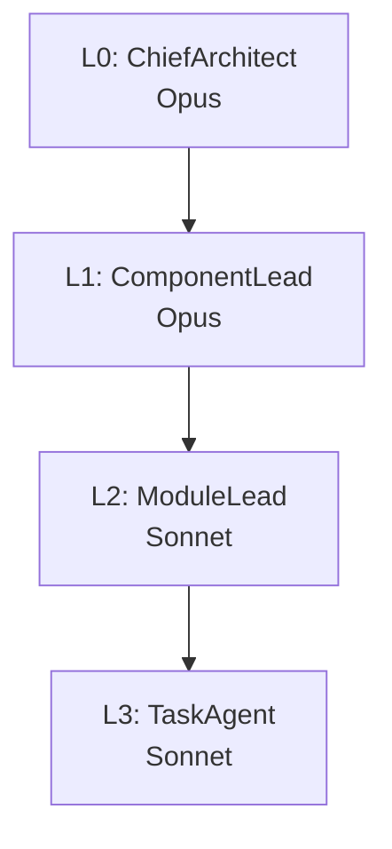

# AGENTS.md — ProjectAgamemnon Multi-Agent Coordination

## Overview

ProjectAgamemnon is the HMAS (Homeric Multi-Agent System) orchestration service within the
HomericIntelligence distributed agent mesh. It receives researched briefs from ProjectNestor and
manages the full 4-layer agent hierarchy: planning breakdown, delegation, state machine
coordination, and pull-based work queue management.

**Pipeline position:** User → Odysseus → Nestor → **Agamemnon** → agentic pipeline loop → completion

Agamemnon does **not** perform research (Nestor's responsibility), provide UI (Odysseus), or make
myrmidon-level decisions (myrmidons communicate peer-to-peer directly).

---

## Agent Hierarchy

### ASCII Tree

```
L0  ChiefArchitect   (Opus)
 └── L1  ComponentLead   (Opus)
      └── L2  ModuleLead     (Sonnet)
           └── L3  TaskAgent     (Sonnet)
```

### Mermaid Diagram



---

## Role Definitions

### L0 — ChiefArchitect (Opus)

- Receives the researched brief from Nestor
- Owns the top-level plan: inter-repo decomposition, cross-cutting concerns, sequencing
- Delegates inter-repo tasks to one or more L1 ComponentLeads
- Gates: approves all destructive or state-modifying operations before they proceed
- Escalates: if clarification is needed, L0 communicates upstream to Nestor/Odysseus

### L1 — ComponentLead (Opus)

- Owns a single repository or major component within the plan
- Breaks the component scope into modules and delegates to L2 ModuleLeads
- Monitors L2 progress; escalates blockers to L0
- Produces per-component summaries consumed by L0 for plan reconciliation

### L2 — ModuleLead (Sonnet)

- Owns a single module or sub-component within a repository
- Breaks the module scope into concrete implementation tasks and delegates to L3 TaskAgents
- Reviews L3 output for correctness before acknowledging completion to L1
- Gates: approves file deletions or schema-altering operations before dispatching to L3

### L3 — TaskAgent (Sonnet)

- Executes a single, bounded implementation task (file edit, test run, build check)
- Pulls work from the NATS PULL consumer for its myrmidon type (`hi.myrmidon.{type}.>`)
- Reports completion or failure to L2; does **not** self-assign follow-on tasks
- MaxAckPending=1: processes exactly one task at a time before acknowledging

---

## Delegation Rules

1. **Top-down delegation only.** Work flows L0 → L1 → L2 → L3. Levels do not skip.
2. **Bottom-up escalation only.** Blockers, ambiguity, and failures propagate upward one level at
   a time.
3. **Approval gates before destructive operations.** Any operation that deletes files, modifies
   shared state, or alters a GitHub Issue/Project must be approved by the delegating level before
   the receiving level executes it.
4. **Clarification is always allowed.** Any level may pause and send a clarification request
   upstream rather than proceeding with an ambiguous or risky action.
5. **No lateral communication between same-level agents.** L3 TaskAgents do not coordinate
   directly; all coordination passes through L2.

---

## Handoff Protocols — NATS Subjects

All inter-component messaging flows through ProjectKeystone as the invisible transport layer.
Components publish and subscribe to logical NATS subjects; routing is transparent.

| Subject | Direction | Purpose |
| ------- | --------- | ------- |
| `hi.tasks.>` | pub/sub | Task state updates; Odysseus reads for UI |
| `hi.pipeline.>` | pub/sub | Pipeline state updates; Odysseus reads for UI |
| `hi.myrmidon.{type}.>` | PULL consumer | Work queue per myrmidon type; L3 agents pull |

**PULL consumer contract:**

- Myrmidons pull work when they are ready. Agamemnon never pushes.
- `MaxAckPending=1` enforces single-task-at-a-time per myrmidon.
- A task is not re-queued until the myrmidon acknowledges (success) or nacks (failure/timeout).
- `{type}` corresponds to the myrmidon specialisation (e.g. `codegen`, `test`, `review`).

---

## State Persistence

GitHub Issues and GitHub Projects are the sole backing store for task and pipeline state.

- Each task maps to a GitHub Issue.
- Each pipeline corresponds to a GitHub Project.
- No relational database, no in-memory store.
- State transitions are durable and auditable via GitHub's event timeline.

---

## Pull-Based Work Queue Contract

Agamemnon enqueues work; myrmidons pull when ready. The contract is:

1. Agamemnon creates (or updates) a GitHub Issue representing the task.
2. Agamemnon publishes the task descriptor to the relevant `hi.myrmidon.{type}.>` subject.
3. An available L3 myrmidon pulls the message from its PULL consumer.
4. The myrmidon executes the task, then acknowledges or nacks the NATS message.
5. Agamemnon updates the GitHub Issue state based on the ack/nack.
6. On nack, Agamemnon applies retry or escalation policy and re-enqueues or escalates to L2.
